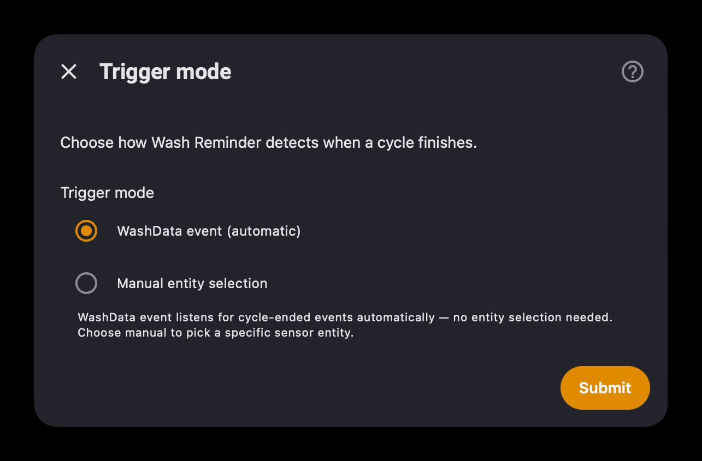
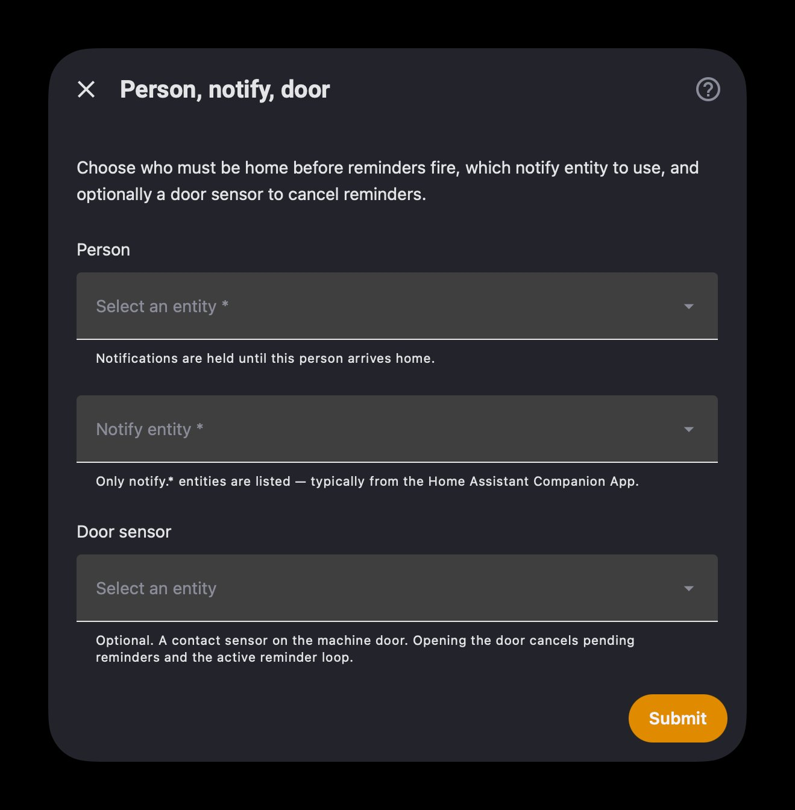
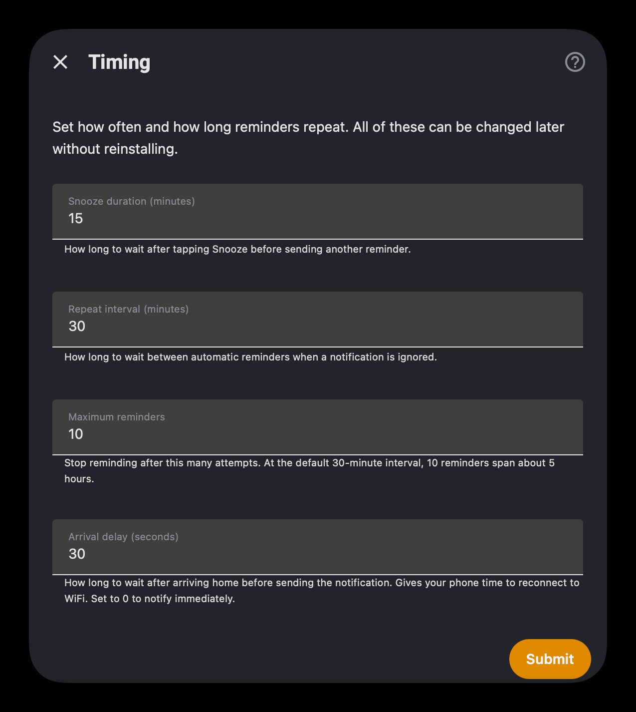

# Wash Reminder

[](https://hacs.xyz/)
[](https://github.com/napieraj/washreminder/releases)
[](https://github.com/napieraj/washreminder/actions/workflows/validate.yaml)
[](https://github.com/napieraj/washreminder/blob/main/LICENSE)

Keeps reminding you to empty the washing machine until you actually do it. Works with [ha_washdata](https://github.com/3dg1luk43/ha_washdata) — no helpers, scripts, or automations needed.

If you're not home when the cycle finishes, the notification waits and fires when you walk through the door. If you open the machine door, reminders cancel automatically. Everything survives HA restarts.

> **Tip:** Turn off WashData's built-in cycle-end notification to avoid getting two alerts at once.

**Quick add via HACS:**

[](https://my.home-assistant.io/redirect/hacs_repository/?owner=napieraj&repository=washreminder&category=integration)

---

## Installation

### HACS

1. **HACS → Integrations → ⋮ → Custom repositories**
2. Add `https://github.com/napieraj/washreminder` as **Integration**
3. Download **Wash Reminder**, restart Home Assistant

### Manual

Copy `custom_components/washreminder/` to your configuration directory and restart.

---

## Setup

**Settings → Devices & services → Add integration → Wash Reminder**

Setup is a short wizard that walks you through five steps. Only the relevant steps are shown depending on your choices.

### Step 1 — Trigger mode

Choose how Wash Reminder detects that a cycle has finished. **WashData event** is the recommended option — it listens for cycle-ended events automatically with no entity selection needed. Choose **Manual entity selection** if you want to pick a specific binary or state sensor yourself.

<p align="center">
  
</p>

### Step 2 — Person, notify, door

Select the person whose presence gates the notification, the notify entity to send reminders to (typically from the Companion App), and an optional door contact sensor. Opening the machine door cancels any pending or active reminders automatically.

<p align="center">
  
</p>

### Step 3 — Timing

Configure how often and how long reminders repeat. All of these can be changed later without reinstalling — go to the integration card and select **Configure**.

<p align="center">
  
</p>

| Field | Default | Description |
| --- | --- | --- |
| Snooze duration | 15 min | How long to wait after tapping Snooze |
| Repeat interval | 30 min | Time between automatic reminders if ignored |
| Max reminders | 10 | Stop after this many attempts (~5 h at default interval) |
| Arrival delay | 30 s | Grace period for your phone to reconnect to WiFi after arriving home. Set to 0 to notify immediately |

> **Note:** Additional steps for **Completion state** and **Door sensor polarity** appear conditionally — only when you choose a state sensor or add a door sensor.

### Reconfiguring after setup

**Timing** can be changed anytime under **Configure** on the integration card. **Entities** (person, notify target, door sensor) can be changed with **⋮ → Reconfigure**, which re-runs the setup wizard without the timing step.

---

## Entities

| Entity | Type | Description |
| --- | --- | --- |
| **Pending notification** | Binary sensor | On while a reminder is deferred until the configured person is home |
| **Activity** | Sensor (diagnostic) | High-level state: idle, deferred until home, waiting before delivery, or sending reminders |
| **Runtime** | Sensor (diagnostic) | Whether the integration is idle, listening for arrival, in the arrival delay, or running the reminder loop |

---

## How it works

```
🧺 Laundry Done
Time to empty the washing machine.

[ Snooze ]   [ Done ✓ ]
```

| What happens | What the integration does |
| --- | --- |
| You tap **Done ✓** | Notification cleared, reminders stop |
| You tap **Snooze** | Notification cleared, new reminder after the snooze duration |
| You ignore it | Another reminder at the repeat interval, with escalating text |
| You open the machine door | Everything cancelled — active reminders, pending state, delivery tasks |
| You leave home while reminders are active | Reminders pause, resume automatically when you return |
| Cycle finishes while you're away | Saved to disk, notification sent when you get home |
| HA restarts while waiting | State restored, notification still sent on arrival |

Each reminder replaces the previous one on your phone — you'll never see a stack of duplicate notifications. Notifications break through Focus mode by default (iOS `time-sensitive`).

---

## Trigger modes

**WashData event** *(recommended)* — listens for `ha_washdata_cycle_ended` events fired by the [ha_washdata](https://github.com/3dg1luk43/ha_washdata) integration. No entity selection needed — cycle completion is detected automatically.

**Binary sensor** — fires when the sensor turns off. WashData debounces this, so brief power dips during a soak phase won't cause false alerts.

**State sensor** — fires when the sensor value changes to your configured completion state. Won't trigger on startup when the sensor goes from `unavailable` to `Idle`. Check the exact state string in **Developer tools → States** — it's case-sensitive.

---

## Door sensor polarity

Most contact sensors in Home Assistant follow the convention where **"on" means open** and **"off" means closed**. The integration uses this by default — when the door sensor reports "on", it assumes the machine door has been opened and cancels any active reminders.

Some sensors work the other way around: they report **"off" when the door is open** and **"on" when closed**. If you find that reminders cancel when you *close* the door instead of when you *open* it, enable **Invert door sensor** in the door step. This tells the integration to listen for "off" instead of "on".

You can check how your sensor behaves in **Developer tools → States** — open and close the door and watch which value appears.

---

## Troubleshooting

**Integration stuck on "Retrying setup"** — WashData hasn't finished loading yet. Reload Wash Reminder after WashData is ready.

**Notification buttons not working** — The Companion App needs notification permissions. On iOS: Settings → Notifications → Home Assistant.

**Reminders cancel at the wrong time** — Your door sensor may have inverted polarity. See [Door sensor polarity](#door-sensor-polarity).

**No notify entities in the picker** — You need Home Assistant **2026.1** or newer and a loaded **notify.*** entity (for example from the Companion App).

**Debug logging:**

```yaml
logger:
  logs:
    custom_components.washreminder: debug
```

**Diagnostics:** Settings → Devices & services → Wash Reminder → **Download diagnostics**

---

## Requirements

- Home Assistant **2026.1.0** or newer (betas from **2026.1.0b0** are supported)
- [ha_washdata](https://github.com/3dg1luk43/ha_washdata) installed and configured
- Home Assistant Companion App (iOS or Android) with notification actions enabled, providing at least one **notify.*** entity

---

## Contributing

Issues and PRs welcome at [github.com/napieraj/washreminder](https://github.com/napieraj/washreminder).

For [HACS default inclusion](https://hacs.xyz/docs/publish/include) checks, the GitHub repository needs a short **description**, relevant **topics** (for example `home-assistant`, `hacs`), and releases must include **`washreminder.zip`** (built automatically when you push a version tag; see [.github/workflows/release.yaml](https://github.com/napieraj/washreminder/blob/main/.github/workflows/release.yaml)).
