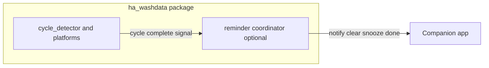

# Design proposal: Wash Reminder and ha_washdata

Use this document as the body (or attachment) for a **new GitHub issue** on ha_washdata, for example:

https://github.com/3dg1luk43/ha_washdata/issues/new

This is not a commitment to merge—only a structured starting point for maintainers. (Opening the issue must be done by a maintainer or contributor with a GitHub account; this repo only ships the text.)

## Context

- **ha_washdata** ([`3dg1luk43/ha_washdata`](https://github.com/3dg1luk43/ha_washdata)): power-based laundry cycle detection, multiple platforms (`sensor`, `binary_sensor`, `select`, `button`), built-in notification options (`CONF_NOTIFY_*`).
- **Wash Reminder** (this repo / [`napieraj/washreminder`](https://github.com/napieraj/washreminder)): separate `washreminder` integration—presence-gated reminders, snooze/done actions, optional door cancel, persistent “pending” across restarts. Users typically point it at WashData’s `binary_sensor` / `sensor` entities and disable WashData’s own end-of-cycle notify to avoid duplicates.

## Goals of a possible merge

1. **Single install path** for users who want both cycle detection and advanced reminders.
2. **Clear product story**: one place to configure “notify when done” vs “remind until emptied.”
3. **No double notifications** without fragile user manual steps.

## Non-goals

- Replacing ha_washdata’s analytics, learning, or entity model.
- Breaking existing WashData configs without migration.

## Options (summary)

| Approach | Effort | HACS / distribution |
|----------|--------|---------------------|
| A. Status quo + docs | Low | Two integrations, documented pairing |
| B. Monorepo (two domains) | Medium | Awkward for standard HACS “one repo = one integration” |
| C. Deep merge: reminder subsystem inside `ha_washdata` | High | One domain, one config flow surface (or clearly linked entries) |

## Recommended direction (for discussion)

**Option C** only if maintainers want it: add an **optional “Wash Reminder” mode** inside ha_washdata (or a sibling module loaded from the same package) that:

- Reuses WashData’s known entity IDs internally instead of free-form entity pickers (or pre-fills them).
- Disables or gates WashData’s legacy cycle-end notification when reminder mode is enabled, with explicit UI copy.
- Preserves Wash Reminder semantics: person gating, arrival delay, repeat/snooze/max, door sensor, `mobile_app_notification_action`, tagged notifications.

## Architecture sketch (Option C)

- **Config**: extend options flow or add a sub-flow “Advanced reminders” with defaults wired to this integration’s entities.
- **State**: reminder pending flag could remain `Store` keyed by config entry id (same as today’s Wash Reminder).
- **Unload**: reuse `entry.async_create_background_task` and `async_on_unload` patterns from Wash Reminder.

## Licensing and redistribution (blocker to resolve first)

WashData’s [LICENSE](https://github.com/3dg1luk43/ha_washdata/blob/main/LICENSE) restricts redistribution and requires written permission for several scenarios. Wash Reminder is distributed under **MIT**.

Any **copy of WashData code into this repo** or **redistribution of WashData** may require explicit permission from the copyright holder. Conversely, **contributing Wash Reminder code into ha_washdata** is a normal upstream contribution subject to ha_washdata’s license and maintainer acceptance—not “redistribution” by Wash Reminder, but the merged work’s license must be clear for contributors and users.

**Action:** maintainers should agree in writing on:

- License of any merged code.
- Whether third-party forks (HACS, etc.) remain allowed under the combined policy.

## Migration

If Option C ships:

1. Add `async_migrate_entry` or a one-time import path from domain `washreminder` → `ha_washdata` options (complex; may be out of scope for v1).
2. Simpler v1: document “remove Wash Reminder, enable reminders in WashData, re-enter person/notify/door settings.”

## Questions for ha_washdata maintainers

1. Is a built-in reminder subsystem desired, or is separation intentional?
2. Should cycle-end notifications and “remind until done” be mutually exclusive in UI?
3. Are you open to a PR that lands reminder logic as an optional submodule, or prefer staying with two integrations + documentation only?

## Contact

Wash Reminder: repository and issues as linked in this project’s [`manifest.json`](../custom_components/washreminder/manifest.json).
